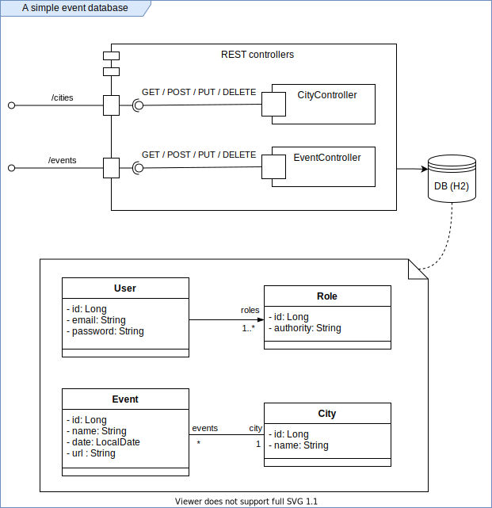

# DevSuperior Bootcamp 2021 (assignment TDD)

A simple event database system exposing CRUD REST developed using TDD (Test-driven Development) approach.
The software requirements were converted into Integration tests and developed guided by that, starting with all tests failing and ending with all tests passing.

Technologies: Java 11, Spring Boot 2.4.x and MockMvc

